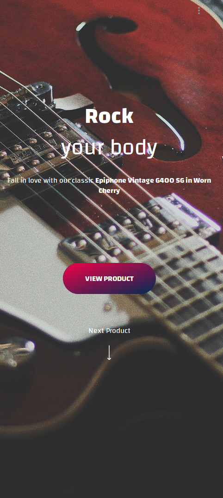
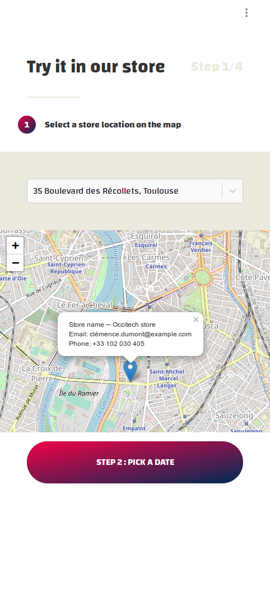
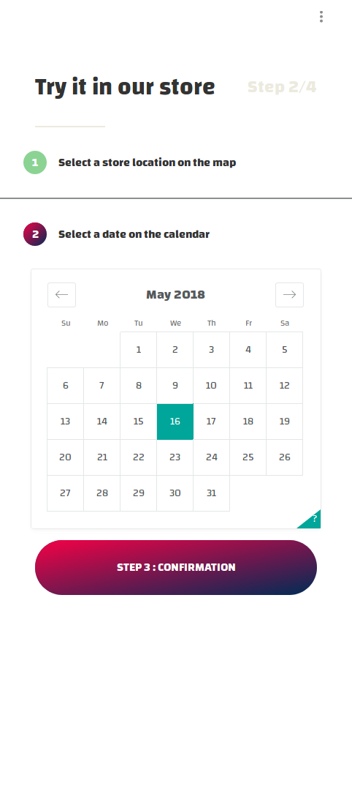

# Online to Offline theme 

* build with front-commerce-lite:*
* Prototype your next eCommerce experiences using modern web technologies.*

Front-Commerce is a React application with a GraphQL middleware for building eCommerce stores backed by existing headless platforms such as Magento2. [Learn more about the product.](https://developers.front-commerce.com/)

## Theme Online to Offline - Overview
This theme is a *mobile first theme* created to illustrate the fact that, while we are in movement, we are doing a lot of things, including buying products. Mobile e-commerce is growing really fast and consumers need applications answering their goals and needs.

With this theme, we’re giving consumers the possibility to combine both online and offline buying experiences, into one. When we’re buying a product online, there’s often a little concern about the matching between what we’re seeing on screen and what will be deliver to us. Because we couldn’t first test the product by ourselves before validating our order.  We tried to resolve that issue in this theme.

Instead of adding products to their cart and proceed a classic order process, users have the possibility to « Test the product in a store » first. They are invited to select a Store location and a Date, then, their order is « paused » until they test the product and decide to finally buy it or not. This choice gives users the feeling to be « in-control » and not depending of the brand they’re buying from. Trust grows between the brand and its consumers and it benefits both.

## Installation instructions
[See Front-Commerce Lite general setup guide](https://github.com/front-commerce/front-commerce-lite/blob/master/README.md)

## Going in production
Convinced that Front-Commerce Lite’s stack is viable enough for your project? If yes, we achieved our goal!

You now have several solutions:

* start a project from scratch using these technologies. If your needs are simple it could be a solution, otherwise prepare yourself to months of work!
* compare with existing alternatives and choose the one which fits your needs and budget: features, architecture, test coverage and (if they are open source) the quality of their codebase
* fork Front-Commerce Lite in the open, follow our philosophy and architecture… and name it React Storefront :slightly_smiling_face:
* use Front-Commerce and start developing your features on top of a production ready solution right now!

:email: Contact our team to get further information and contract a Front-Commerce license.

## License
MIT
